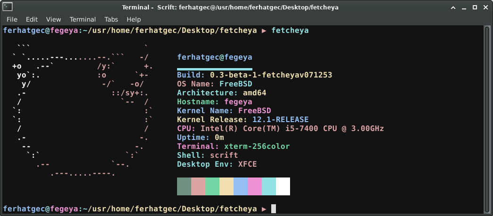

# Fetcheya
## Fegeya Fetcheya is Scrift's System Information Tool.

### Supported Platforms:
- [x] Almost all GNU/Linux distros.
   * [x] Fedora
   * [x] Ubuntu
   * [x] Arch
   * [x] CentOS etc.
- [x] FreeBSD
- [ ] OpenBSD (Untested)
- [ ] NetBSD (Untested)
- [ ] GNU/Hurd (I don't know)

#### Fegeya Fetcheya licensed with MIT License.
